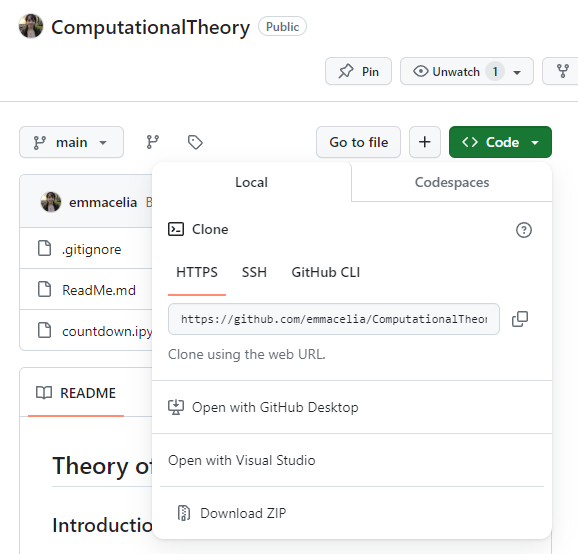

# Computational Theory Assessment 

## Description
This project discusses the numbers game of countdown. The project will explain what the game is and the computational complexity. It will also show approaches to solving the game. The project also includes an implementation of the numbers game. 

## Getting Started
### Clone the repository
- In oder to clone the github repository, use the following command:  
     `git clone <Link to Repository> `  
- The link to the repository can be found inside the green code button. Once inside this pop-up, the repository link can be copied as seen in the image below. 
   
   
- Choose the location that you want to store the contents of the repository for example on the Desktop or in Documents.
- Open a command prompt and enter the git clone command as seen above.
- Once the repository is cloned, use the following command to open it in your default code editor. 
   `code .`  
### Install the necessary packages to run the Python code
In order for the code to run you must install the necessary packages. Open a command promp in the repository directory and run the following commands
  `pip install qiskit`
  `pip install qiskit-aer`
Code cells inside the projects will now be able run. 
## Prerequisites
- A version of Python installed on your machine is required
- A version of pip to install the required packages

## How to use the project 
You can view the project by opening the Jupyter notebook that is associated with it. Inside the notebook you can run the code cells. 
